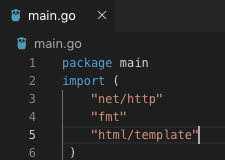
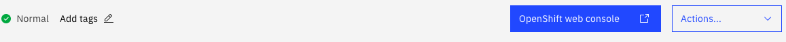
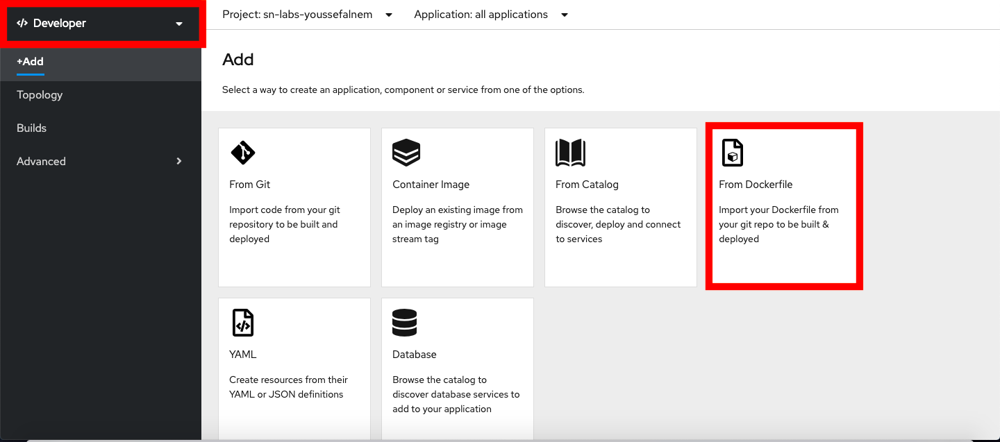
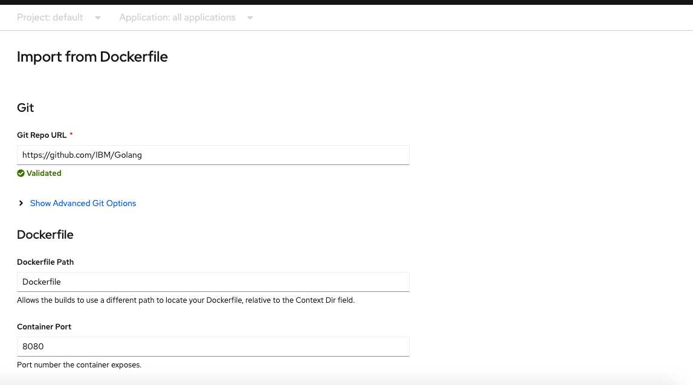
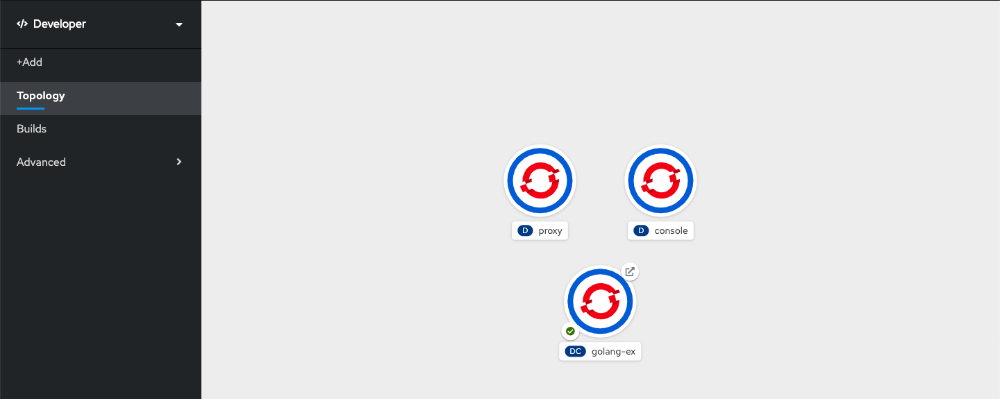
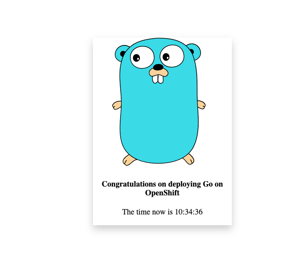

# Golang on OpenShift

Golang is a pretty popular programming language nowadays, thanks for its ability to work on large distributed servers and to be a better alternative for C++ and Java. With Golang, you can create chatrooms, large distributed websites, and many other types of applications, without running into any hard-to-debug errors, such as in C++. Similarly, Golang is very easy to learn, as it is rather close to C++ and Java in terms of syntax and concepts, and it is maintained by a large community.

Kubernetes is one of the old-fashioned way of deploying a scalable application. However, OpenShift provides us with the ease of deploying an application without relying on the command-line.

In this tutorial, we will demonstrate how to take a simple Golang website and have it deployed on an OpenShift Cluster.


## Prerequisites

* Code Editor (VSCode, Sublime, etc.)
* IBM Cloud Account
* OpenShift Cluster
* (Optional) Github Account
* (Optional) oc Command Line

This tutorial assumes one is familiar with using Docker and writing Dockerfiles, as this website is dependent on the Dockerfile, and one has an OpenShift Cluster created.

## Estimated Time
This tutorial should take around 10-15 minutes to complete.

## Developing the Web Server

This tutorial uses the net/http library in Go to create the web server, where we map our web pages (the final URL can be different from the page's name). There are different libraries for Web Development in Go, but net/http is the easiest for starters. 

The Go file will begin by defining the package; it refers to the name of the file, e.g main.go will have package main, as presented in the screenshot.
The html/template library is used to render the pages in the browser, and the fmt library is to print out in the console (similar to cout in C++ and println in Python)



We create our main function and define our template variable to get the HTML files in our template folder. Variables use the syntax x:= y for initialization.

``` go
func main() {
 
	//We tell Go exactly where we can find our html file. We ask Go to parse the html file (Notice
	// the relative path). We wrap it in a call to template.Must() which handles any errors and halts if there are fatal errors
	
	templates := template.Must(template.ParseGlob("template/*"))
```

Next, we create a handle for Go to look into our static folder, which contains the CSS files, as presented in this code snippet.

``` go
//Our HTML comes with CSS that Go needs to provide when we run the app. Here we tell go to create
	// a handle that looks in the static directory, go then uses the "/static/" as a url that our
	//html can refer to when looking for our css and other files. 
	
	http.Handle("/static/", //final url can be anything
	   http.StripPrefix("/static/",
		  http.FileServer(http.Dir("static")))) //Go looks in the relative "static" directory first using http.FileServer(), then matches it to a
		  //url of our choice as shown in http.Handle("/static/"). This url is what we need when referencing our css files
		  //once the server begins. Our html code would therefore be <link rel="stylesheet"  href="/static/stylesheet/...">
		  //It is important to note the url in http.Handle can be whatever we like, so long as we are consistent.
```

So far, we have obtained our HTML pages and linked the directories for the CSS files. The next thing to do here is to write handle functions for our URLs. The http.HandleFunc takes a URL path and a function that takes a responseWriter and a pointer (similar to C++) to an HTTP request. Go allows for annonymous functions to be passed as parameters, just like C++ and Java. Here we create the handle function for the homepage:
``` go 
	//This method takes in the URL path "/" and a function that takes in a response writer, and a http request.
	http.HandleFunc("/" , func(w http.ResponseWriter, r *http.Request) {
 
	   //If errors show an internal server error message
	   if err := templates.ExecuteTemplate(w, "homepage.html", nil); err != nil {
		  http.Error(w, err.Error(), http.StatusInternalServerError)
	   }
	})
```

Finally, we print the web server is listening to requests and link the website to port no. 8080.
``` go
	fmt.Println("Listening");
	fmt.Println(http.ListenAndServe(":8080", nil));
 }
 ```

This concludes building the web server. To get a better understanding of the Dockerfile written, refer to this [link](https://hub.docker.com/_/golang)
## Deploying the Golang Website
There are two ways of deploying the website on OpenShift, either from the web console or the oc command line. In this tutorial, we will go through both methods.

Start by signing up and logging in to [IBM Cloud](cloud.ibm.com)


# Using OpenShift's Web Console

### Step 1: Access your OpenShift Cluster

Log on to your OpenShift cluster using the blue button as the one in the screenshot.



### Step 2: Add the website to your cluster

Change to the Developer View and click on the "+Add" button, as in the screenshot. Next, select to build your application from Dockerfile.



Insert the following URL in the Git Repo field, as presented in the screenshot, and choose to expose a route to your application:

```
https://github.com/IBM/Golang 
```



### Step 3: Start the Website 

Click on the "Create" button at the bottom of the page and go to the Topology tab. After the build is finished, you will find the pod has started. Click on the arrow button to open the website.




# Using OC Command Line

### Step 1: Login to the Cluster using oc login
Login to your cluster using 

``` bash
oc login
```
and write your cluster credentials.

### Step 2: Download the Code and Deploy the Website

Download the code from this repo 
```bash 
https://github.com/IBM/Golang 
```
on your computer and write the following commands to deploy and expose the website:

``` bash
cd Golang
oc new-app . --name=golang-ex
oc expose svc/golang-ex
```

### Step 3: Get the Route

To get the route of the exposed website, write the command

``` bash
oc get route golang-ex
```
Copy the URL of the website and paste it in your browser.

Once all of the above is done correctly, the following page should be displayed.



Congratulations! You have successfully deployed your first Golang website on your OpenShift Cluster.